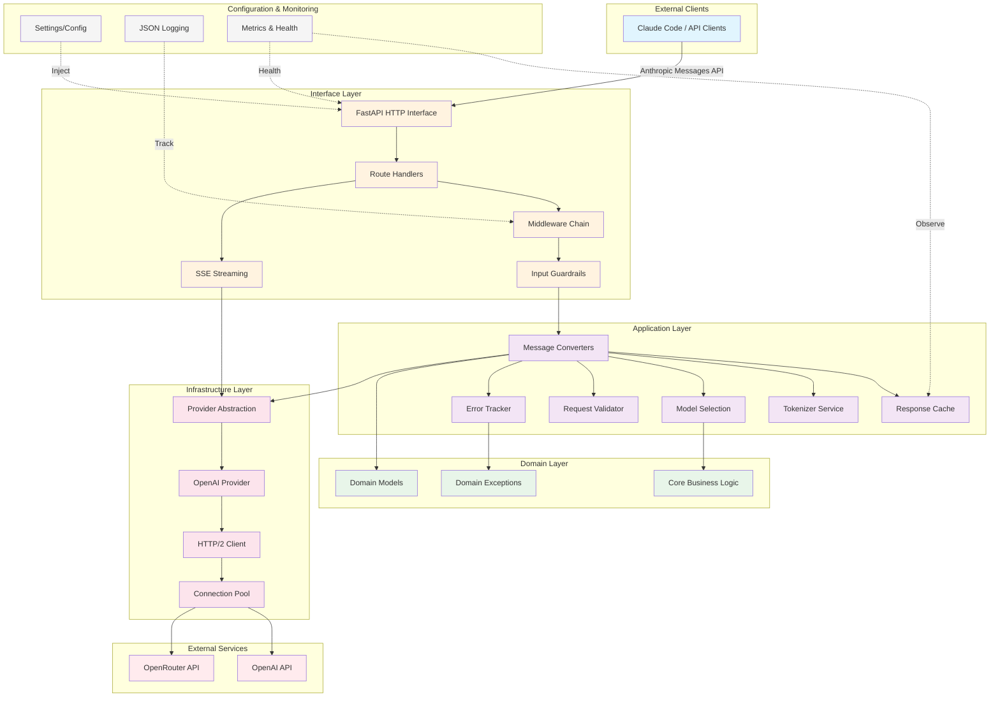

# CCProxy

🌾 🥳 🌋 🏰 🌅 🌕 Claude Code Proxy 🌖 🌔 🌈 🏆 👑

## Motivation

Recent analytics show a large cost gap between major models: OpenAI GPT‑5 is far more cost‑efficient than Anthropic Claude Opus 4.1 (≈$11.25 vs ≈$90 per 1M input+output tokens). CCProxy helps teams control AI spend and latency by minimizing duplicate work, maximizing transport efficiency, and serving as a drop‑in proxy for OpenAI‑compatible APIs. This allows organizations to standardize on one integration while selecting the most cost‑effective model per workload.

### Pricing Overview

| Model                   | Input Tokens (\$/1M) | Output Tokens (\$/1M) |
| ----------------------- | -------------------- | --------------------- |
| **OpenAI: GPT‑5**        | \$1.25               | \$10.00               |
| **Anthropic: Claude Opus 4.1**     | \$15.00              | \$75.00               |
| **xAI: Grok Code Fast 1**    | \$0.20               | \$1.50                |

* **GPT‑5** input and output rates are confirmed via Wired, OpenAI's own API pricing page, and TechCrunch
* **Claude Opus 4.1** pricing is stated directly on Anthropic's API pricing page
* **Grok Code Fast 1** pricing is from xAI's official OpenRouter listing

### Model Token Limits

CCProxy enforces maximum output token limits for supported models:

| Model | Context Window | Max Output Tokens |
|-------|----------------|------------------|
| **o3** | 200,000 | 100,000 |
| **o3-2025-04-16** | 200,000 | 100,000 |
| **o4-mini** | 128,000 | 100,000 |
| **gpt-5-2025-08-07** | 400,000 | 128,000 |
| **gpt-5** | 400,000 | 128,000 |
| **gpt-5-mini-2025-08-07** | 400,000 | 128,000 |
| **gpt-5-mini** | 400,000 | 128,000 |
| **deepseek-reasoner** | 163,840 | 65,536 |
| **deepseek-chat** | 163,840 | 8,192 |
| **grok-code-fast-1** | 256,000 | 10,000 |

*Note: Models not listed in this table use their default maximum output token limits.*

## ⚡ Performance Optimizations

CCProxy includes high-performance HTTP client optimizations for faster OpenAI API communication:

* **HTTP/2 Support**: Enabled by default for request multiplexing
* **Enhanced Connection Pooling**: 50 keepalive connections, 500 max connections
* **Compression**: Supports gzip, deflate, and Brotli
* **Smart Retries**: Automatic retry with exponential backoff
* **Response Caching**: Prevents duplicate API calls and handles timeouts
* **Async Processing**: Full async/await architecture with ThreadPoolExecutor for CPU-bound operations
* **Parallel Message Conversion**: Concurrent processing of message batches for reduced latency
* **Non-blocking I/O**: Async streaming with httpx for improved throughput

### Performance Improvements

* 30-50% faster single request latency
* 2-3x better throughput for concurrent requests
* Reduced connection overhead with persistent connections
* 40% reduction in message conversion time via async parallelization
* Near-zero blocking on I/O operations with full async pipeline

See [HTTP_OPTIMIZATION.md](HTTP_OPTIMIZATION.md) for details.

## Architecture

CCProxy follows Clean Architecture (Hexagonal Architecture) principles with clear separation of concerns:



### Layer Responsibilities

#### 🎯 Domain Layer (`ccproxy/domain/`)
- **Core Business Logic**: Pure business rules independent of external concerns
- **Domain Models**: Core entities and data structures
- **Domain Exceptions**: Business-specific error handling

#### 🔧 Application Layer (`ccproxy/application/`)
- **Use Cases**: Orchestrates domain logic and infrastructure
- **Message Conversion**: Anthropic ↔ OpenAI format translation
- **Caching Strategy**: Response caching with de-duplication
- **Token Management**: Async token counting with TTL cache (300s)
- **Model Mapping**: Routes requests to appropriate models (Opus/Sonnet→BIG, Haiku→SMALL)
- **Request Validation**: Cryptographic hashing with LRU cache (10k capacity)

#### 🌐 Infrastructure Layer (`ccproxy/infrastructure/`)
- **Provider Integration**: OpenAI/OpenRouter API communication
- **HTTP/2 Client**: High-performance connection pooling (500 connections, 120s keepalive)
- **Circuit Breaker**: Fault tolerance and resilience patterns
- **External Services**: Handles all third-party integrations

#### 📡 Interface Layer (`ccproxy/interfaces/`)
- **HTTP API**: FastAPI application with dependency injection
- **Route Handlers**: Request/response processing
- **SSE Streaming**: Real-time response streaming
- **Middleware**: Request tracing, logging, error handling
- **Input Validation**: Security guardrails and sanitization

#### ⚙️ Cross-Cutting Concerns
- **Configuration**: Environment-based settings with Pydantic validation
- **Logging**: Structured JSON logging with request correlation
- **Monitoring**: Performance metrics, health checks, cache statistics
- **Error Tracking**: Centralized error monitoring and alerting

## Quickstart (uv + .env + Gunicorn)

1. Create your environment file from the template:

```bash
cp .env.example .env
# edit .env to set OPENAI_API_KEY, BIG_MODEL_NAME, SMALL_MODEL_NAME
```

2. Install Python dependencies into an isolated environment using uv:

```bash
curl -LsSf https://astral.sh/uv/install.sh | sh
uv venv
. .venv/bin/activate
uv pip install -r requirements.txt
```

3. Start the server (pure Python with Gunicorn):

```bash
./run-ccproxy.sh
```

For local development, you can set `IS_LOCAL_DEPLOYMENT=True` in your `.env` file to use a single worker process for reduced resource usage.

4. Point your Anthropic client at the proxy:

```bash
export ANTHROPIC_BASE_URL=http://localhost:11434
```

Then start your coding session with Claude Code:

```bash
claude
```

## Environment Variables

### Required Variables

* `OPENAI_API_KEY`: Your OpenAI API key (or use `OPENROUTER_API_KEY`)

* `BIG_MODEL_NAME`: The OpenAI model to use for large Anthropic models (e.g., `gpt-5-2025-08-07`)
* `SMALL_MODEL_NAME`: The OpenAI model to use for small Anthropic models (e.g., `gpt-5-mini-2025-08-07`)

### Optional Variables

* `IS_LOCAL_DEPLOYMENT`: Set to `True` to use a single worker process for local development (default: `False`)

* `HOST`: Server host (default: `127.0.0.1`)
* `PORT`: Server port (default: `11434`)
* `LOG_LEVEL`: Logging level (default: `INFO`)
* `OPENAI_BASE_URL`: OpenAI API base URL (default: `https://api.openai.com/v1`)

## Author

CCWorkforce Engineers
